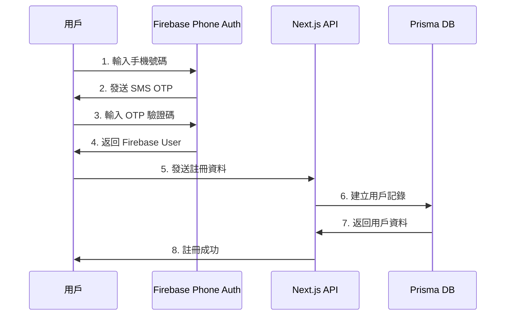
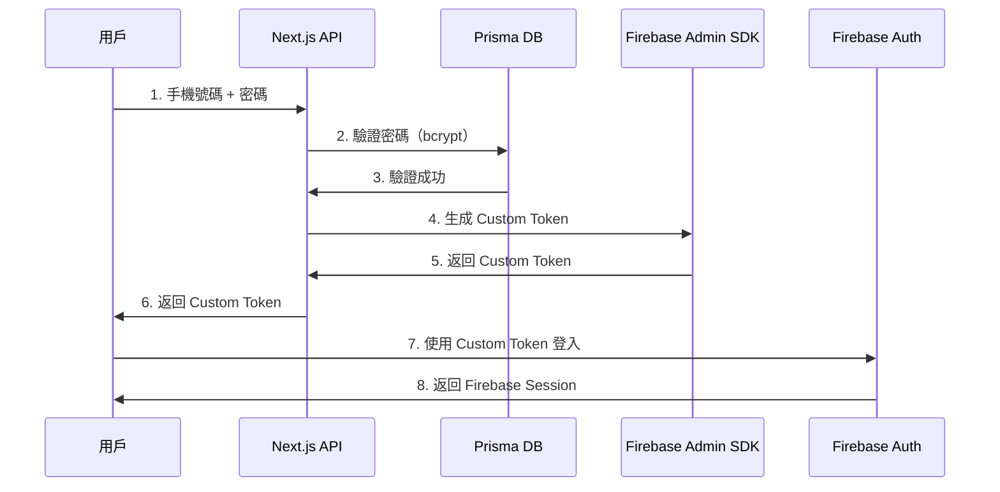

# 認證系統文檔

> Firebase Authentication POC 完整技術文檔

[](./guides/current-flow.md)
[](.)

---

## 🎯 專案目標

此專案為 **Firebase 認證系統研究型 POC**，目標是：

1. 研究和實作完整的 Firebase Authentication 功能
2. 探索各種認證方式的整合（OAuth、Phone Auth、密碼登入）
3. 驗證混合架構的可行性（Firebase + Prisma）
4. 為 web-hubble 專案提供認證系統實作參考

**注意**：此為研究專案，不是傳統的最小可行性驗證（MVP）POC。

---

## 📚 快速開始

### 新手入門

1. **[當前實作狀態](./guides/current-status.md)** - 了解目前實作的功能
2. **[架構決策記錄](./decisions/README.md)** - 了解系統設計的技術決策
3. **[與 web-hubble 的差異](./analysis/comparison-with-hubble.md)** - POC vs 目標架構

### 已實作功能

- ✅ Google OAuth 登入
- ✅ 手機號碼註冊（3 步驟：手機 → OTP → 資料）
- ✅ 手機 + 密碼登入（使用 Custom Token）
- ✅ 密碼重設（3 步驟：手機 → OTP → 新密碼）
- ✅ Dashboard 展示頁
- ✅ 用戶管理介面（開發工具）

### 計劃研究功能

- 📋 LINE OAuth 整合
- 📋 Facebook OAuth 整合
- 📋 雙層認證架構（Firebase + Backend JWT）
- 📋 Email 驗證
- 📋 多因素認證（2FA）

---

## 🏛️ 目前架構

### 混合認證架構（POC 版本）

```
┌─────────────────────────────────────────────────────────────┐
│                         用戶端                              │
├─────────────────────────────────────────────────────────────┤
│                                                             │
│  Firebase Authentication (前端)                             │
│  ├─ OAuth (Google/Facebook/LINE)                           │
│  ├─ Phone Authentication (SMS OTP)                         │
│  └─ 獲取 Firebase ID Token 或 Custom Token                  │
│                                                             │
│  Prisma Database (後端)                                     │
│  ├─ 用戶資料管理                                             │
│  ├─ 密碼儲存（bcrypt hash）                                  │
│  └─ Custom Token 橋接 Firebase Session                      │
│                                                             │
└─────────────────────────────────────────────────────────────┘
```

### 技術堆疊

- **前端**: Next.js 15 + React 19 + TypeScript + Tailwind CSS
- **認證**: Firebase Authentication (OAuth + Phone Auth)
- **資料庫**: Prisma ORM + SQLite (dev) / PostgreSQL (prod)
- **後端**: Next.js API Routes + Firebase Admin SDK
- **狀態管理**: Zustand（計劃中）

---

## 📋 文檔導覽

### 🏗️ 架構決策 (Decisions)

記錄重要技術決策的背景、考量和結果（ADR 格式）。

| ADR | 標題 | 決策 | 狀態 |
|-----|------|------|------|
| [ADR-001](./decisions/adr-001-password-storage.md) | 密碼儲存位置 | 密碼存 Prisma，不在 Firebase | ✅ Accepted |
| [ADR-002](./decisions/adr-002-custom-token.md) | Custom Token 橋接 | 使用 Custom Token 建立 Firebase Session | ✅ Accepted |

📋 [查看所有決策記錄](./decisions/README.md)

### 📖 實作指南 (Guides)

開發人員實作認證功能時的操作手冊。

| 文檔 | 描述 | 狀態 |
|------|------|------|
| [當前實作狀態](./guides/current-status.md) | 已實作功能和待研究項目 | ✅ Active |
| [手機註冊流程](./guides/phone-registration.md) | 手機號碼註冊實作說明 | ✅ Active |
| [密碼重設流程](./guides/password-reset.md) | 密碼重設功能實作說明 | ✅ Active |

### 📊 分析報告 (Analysis)

系統分析、審查報告和專案總結。

| 文檔 | 描述 | 更新日期 |
|------|------|----------|
| [與 web-hubble 比較](./analysis/comparison-with-hubble.md) | POC 架構 vs web-hubble 目標架構 | 2025-11-21 |
| [專家審查報告](./analysis/expert-review.md) | 三位專家的審查結果 | 2025-11-21 |

### 📘 參考資料 (Reference)

API 文檔和技術參考資料。

| 文檔 | 描述 |
|------|------|
| [API 參考文檔](./reference/api-reference.md) | API 端點和資料格式 |
| [程式碼位置索引](./reference/code-locations.md) | 關鍵程式碼檔案位置 |

---

## 🔄 認證流程總覽

### 手機號碼註冊流程



### 手機 + 密碼登入流程



---

## 🎯 與 web-hubble 的關鍵差異

| 項目 | Firebase Auth POC | web-hubble 目標 |
|------|-------------------|-----------------|
| 架構 | 單層 Firebase + Prisma | 雙層 Firebase + Backend JWT |
| 密碼儲存 | Prisma DB | Firebase Email/Password Auth |
| 登入方式 | Custom Token 橋接 | Firebase ID Token → Backend JWT |
| API 認證 | Firebase Session | Backend JWT (Bearer Token) |

詳細比較請參考：[與 web-hubble 比較](./analysis/comparison-with-hubble.md)

---

## 🛠️ 開發資源

### 關鍵程式碼位置

```
src/
├── app/
│   ├── api/auth/              # 認證 API Routes
│   │   ├── oauth/callback/    # OAuth 處理
│   │   ├── register-phone/    # 手機註冊
│   │   ├── create-custom-token/ # Custom Token 生成
│   │   └── reset-password/    # 密碼重設
│   ├── login/                 # 登入頁面
│   ├── register/
│   │   ├── manual/            # 手機註冊頁
│   │   └── complete/          # OAuth 註冊完成頁
│   ├── forgot-password/       # 密碼重設頁
│   └── dashboard/             # 登入後頁面
├── components/
│   └── auth/
│       └── OAuthButtons.tsx   # OAuth 登入按鈕
└── lib/
    ├── firebase.ts            # Firebase SDK 初始化
    ├── firebaseAdmin.ts       # Firebase Admin SDK
    └── prisma.ts              # Prisma Client
```

完整程式碼地圖：[程式碼位置索引](./reference/code-locations.md)

---

## 📞 聯絡與支援

- **問題回報**: GitHub Issues
- **技術討論**: 專案 Pull Request
- **架構討論**: 提交新的 ADR 提案

---

**最後更新**: 2025-11-21
**維護者**: 開發團隊
